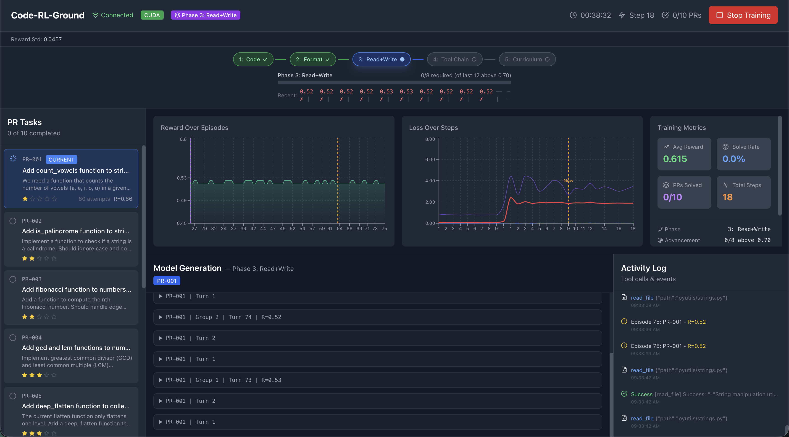

# Code-RL-Ground



An RL-based code learning environment where a small language model learns to master a repository by solving PRs sequentially using **GRPO (Group Relative Policy Optimization)** with LoRA fine-tuning.

## Overview

This project trains a model to become a "master of the repository" by:
1. Learning to solve 10 PR tasks in dependency order against the `pyutils` codebase
2. Using tools (read/write/edit files, run code) in multi-turn episodes
3. Computing composite rewards from syntax validity, test passing, file matching, and exact match
4. **Format warm-up** — dense shaping reward that teaches the model tool-call syntax before task rewards kick in
5. Updating only LoRA adapters via GRPO with token-level log probabilities
6. Passing a championship round after solving all PRs

### Model

Any HuggingFace causal LM can be used — just set `model.name` in `configs/config.yaml`. The default is **Qwen/Qwen2.5-0.5B-Instruct** (0.5B params, instruction-tuned, chosen for fast iteration and low memory), but you can swap in any model that fits your hardware (e.g. `Qwen/Qwen2.5-1.5B-Instruct`, `google/gemma-3-1b-it`, `meta-llama/Llama-3.2-1B-Instruct`, etc.).

## Architecture

```
code-rl-ground/
├── configs/
│   └── config.yaml         # All configuration (model, training, rewards, etc.)
├── dataset/
│   ├── base_repo/           # pyutils — the repository the model learns
│   ├── prs/                 # 10 PR task definitions (pr_001.json – pr_010.json)
│   ├── index.json           # PR metadata, dependency graph, difficulty levels
│   └── repo_info.json       # Repository metadata
├── src/
│   ├── agent/
│   │   ├── policy.py        # LLMPolicy — model loading, LoRA, generation, log probs
│   │   └── grpo_trainer.py  # GRPOTrainer — rollout collection, advantage computation, updates
│   ├── data/
│   │   ├── pr_loader.py     # Load & validate PR task definitions
│   │   ├── curriculum.py    # Dependency-aware task ordering
│   │   └── augmentation.py  # Prompt augmentation strategies
│   ├── environment/
│   │   ├── code_env.py      # Gym-like CodeEnv — reset/step/reward cycle
│   │   ├── sandbox.py       # Sandboxed Python execution (subprocess, timeouts)
│   │   └── tools.py         # Tool registry — read_file, write_file, edit_file, run_python, submit
│   ├── rewards/
│   │   ├── reward_fn.py     # Composite reward: syntax + compile + tests + file match + exact match
│   │   ├── format_reward.py # Format warm-up: dense reward for tool-call syntax (3-phase decay)
│   │   ├── syntax_checker.py# AST-based syntax validation
│   │   ├── diff_scorer.py   # Diff-based similarity scoring
│   │   └── test_runner.py   # Run test cases against generated code
│   ├── server/
│   │   ├── api.py           # FastAPI REST + WebSocket endpoints
│   │   └── websocket.py     # WebSocket connection manager
│   └── utils/
│       ├── config.py        # Typed dataclass config from YAML
│       ├── logging.py       # Structured logging with JSON + WebSocket broadcast
│       ├── metrics.py       # ExperimentLogger with moving averages, EMA tracking
│       └── repo_state.py    # Repository snapshot & working directory management
├── ui/                      # React 18 + Vite + TypeScript + Tailwind + Recharts dashboard
├── scripts/
│   ├── train.py             # CLI training entrypoint
│   ├── evaluate.py          # Evaluate a trained model on PR tasks
│   └── serve.py             # Launch FastAPI dashboard server
├── checkpoints/             # Saved LoRA checkpoints (auto-cleaned to keep last N)
├── cache/                   # Working directories for sandbox execution
└── logs/                    # Training logs (JSONL + console)
```

## Quick Start

### Prerequisites

- Python 3.10+
- Node.js 18+ (for the dashboard UI)
- macOS (MPS), Linux (CUDA), or CPU

### 1. Install Dependencies

```bash
# Create virtual environment
python -m venv .venv
source .venv/bin/activate

# Python dependencies
pip install -r requirements.txt

# UI dependencies (optional, for dashboard)
cd ui && npm install && cd ..
```

### 2. Configure

Edit `configs/config.yaml`:

```yaml
model:
  name: "Qwen/Qwen2.5-0.5B-Instruct"  # Any HuggingFace causal LM
  device: "auto"                 # auto-detects CUDA > MPS > CPU
  quantization: "auto"           # 4bit on CUDA, none on MPS/CPU

training:
  algorithm: "grpo"
  learning_rate: 1.0e-5
  batch_size: 1
  max_episodes: 1000

  grpo:
    group_size: 4       # K completions per prompt
    beta: 0.1           # KL penalty coefficient
    clip_range: 0.2     # PPO-style clipping

  lora:
    enabled: true
    r: 32
    alpha: 64
    target_modules:
      - q_proj
      - v_proj
      - k_proj
      - o_proj
      - gate_proj
      - up_proj
      - down_proj

environment:
  mode: "multi_turn"
  max_turns: 10

curriculum:
  strategy: "dependency"
  strict_progression: true
  solve_threshold: 0.9
  min_consecutive_solves: 3

rewards:
  weights:
    syntax_valid: 0.15
    compiles: 0.05
    tests_pass: 0.30
    files_match: 0.30
    exact_match: 0.20
```

### 3. Run Training

**Option A: CLI (no UI)**
```bash
python scripts/train.py --config configs/config.yaml
```

**Option B: Dashboard (development)**
```bash
# Terminal 1 — API server
python scripts/serve.py

# Terminal 2 — UI dev server with hot reload
cd ui && npm run dev
```
Open http://localhost:3000 → click **Start Training**

**Option C: Dashboard (production)**
```bash
cd ui && npm run build && cd ..
python -m src.server.api
```
Open http://localhost:8000 → click **Start Training**

### 4. Evaluate

```bash
python scripts/evaluate.py \
  --model checkpoints/step_100/model \
  --output results.json
```

### 5. Stop Training

- **Dashboard**: Click the Stop button — sends a graceful stop signal to the trainer
- **CLI**: `Ctrl+C` — the training loop exits cleanly

## How GRPO Works

### Algorithm (TinyZero / veRL-inspired)

GRPO generates multiple completions for the same prompt and uses group-relative advantage normalization to update the policy:

```
For each training step:
  1. Select next unsolved PR from curriculum
  2. Generate K=4 full episode rollouts (each up to 10 tool-use turns)
  3. Compute composite reward for each episode (syntax + tests + diff + exact match)
  4. Normalize advantages within the group:  A_i = (r_i − mean(r)) / std(r)
  5. Recompute token-level log probs under current policy (with gradients)
  6. Clipped surrogate loss:  L = −min(ratio × A, clip(ratio, 1±ε) × A)
  7. KL penalty:  KL = |old_logp − new_logp|  (low-variance approximation)
  8. Single AdamW step on LoRA parameters only
```

### Key Implementation Details

- **Token-level**: Log probabilities and advantages are computed per-token, not per-sequence
- **Masked loss**: Only response tokens contribute to the loss (prompt tokens are masked)
- **Memory efficient**: Optimizer state only tracks LoRA parameters (`requires_grad` filter), not the frozen base model
- **Checkpoint cleanup**: Old checkpoints are automatically pruned (configurable `keep_last_n`)
- **Multi-turn context**: Conversation history from prior turns is included in subsequent prompts

### Update Cadence

| Unit | Definition |
|------|-----------|
| **1 episode** | Model interacts with env until `submit()` or max turns |
| **1 step** | `group_size` (4) episodes → 1 gradient update |
| **1 PR solved** | Reward ≥ 0.9 for 3 consecutive solves |

### Reward Function

| Component | Weight | Description |
|-----------|--------|-------------|
| `syntax_valid` | 0.15 | All generated Python files parse without errors |
| `compiles` | 0.05 | Code compiles (same as syntax for Python) |
| `tests_pass` | 0.30 | Proportion of test cases passing |
| `files_match` | 0.30 | Diff similarity to expected file contents |
| `exact_match` | 0.20 | Bonus for exact match on target files |

Total reward is clamped to `[0, 1]`. The solve threshold is **0.9**.

### Format Warm-Up Reward

Small models (≤ 1B) often fail to produce valid tool calls early in training, yielding zero task reward and no learning signal. The **format reward** provides dense shaping that teaches the `<tool>...</tool>` syntax before the model needs to solve actual tasks.

| Signal | Points | What it detects |
|--------|--------|-----------------|
| `tool_tag` | 0.06 | Any `<tool>...</tool>` block present |
| `valid_tool_name` | 0.04 | Tool name matches known registry |
| `valid_args` | 0.04 | Parenthesised arguments parse correctly |
| `multi_step` | 0.03 | Multiple tool calls across turns |
| `submit` | 0.03 | Episode ends with `submit()` |

Max format reward per episode: **~0.20**

**3-phase schedule:**

| Phase | Steps | Format weight | Purpose |
|-------|-------|---------------|---------|
| Warm-up | 0 – 50 | 1.0 (full) | Teach tool syntax from scratch |
| Decay | 50 – 150 | Linear → 0.0 | Gradually shift to task reward |
| Off | 150+ | 0.0 | Pure task reward only |

Final episode reward = `min(1.0, task_reward + format_weight × format_reward)`

The scorer recognises 19 tool names covering the native tool set plus common agentic platform tools, making trained models more adaptable.

### Strict Progression

The model must:
- Achieve reward ≥ 0.9 (solve threshold) on the current PR
- Do so 3 consecutive times (to confirm mastery, not luck)
- Have all dependency PRs already solved

Only then does the curriculum advance to the next PR.

## Tool Format

The model generates tool calls in this format:
```
<tool>tool_name(param="value")</tool>
```

| Tool | Description |
|------|-------------|
| `read_file(path)` | Read a file from the repository |
| `write_file(path, content)` | Create a new file |
| `edit_file(path, old_content, new_content)` | Edit an existing file |
| `run_python(code)` | Execute Python code in sandbox |
| `submit()` | Submit solution for reward evaluation |

## Dataset

10 PR tasks against the `pyutils` repository, ordered by dependency and difficulty (1–5):

Each PR in `dataset/prs/pr_XXX.json`:
```json
{
  "pr_id": "PR-001",
  "title": "Add count_vowels function",
  "description": "Implement a function that counts vowels in a string",
  "difficulty": 1,
  "depends_on": [],
  "files_changed": ["pyutils/strings.py"],
  "expected_changes": {
    "pyutils/strings.py": {
      "action": "modify",
      "additions": ["def count_vowels(s: str) -> int:", "..."]
    }
  },
  "test_cases": [
    { "input": "hello", "expected": 2 },
    { "input": "AEIOU", "expected": 5 }
  ]
}
```

The dependency graph in `dataset/index.json` ensures PRs are solved in a valid topological order.

## Dashboard UI

The React dashboard provides real-time visibility into training:

- **PR Progress** — Visual tracker showing solved / in-progress / pending PRs with difficulty stars
- **Live Generation** — Streaming model output as it generates tool calls
- **Reward Chart** — Area chart with per-episode rewards and moving average
- **Loss Chart** — Policy gradient loss, KL divergence, and total loss over steps
- **Metrics Panel** — Steps, episodes, average reward, solve rate, device info
- **Tool Call Log** — Timestamped log of every tool call and result
- **Training Controls** — Start / stop training from the browser

## API Endpoints

| Method | Endpoint | Description |
|--------|----------|-------------|
| `GET` | `/api/config` | Current configuration |
| `GET` | `/api/status` | Training status (running, step, episode, device) |
| `GET` | `/api/prs` | All PR tasks with solve status |
| `GET` | `/api/pr/{pr_id}` | Detailed PR info |
| `POST` | `/api/training/start` | Start training (accepts config overrides) |
| `POST` | `/api/training/stop` | Gracefully stop training |
| `GET` | `/api/logs` | Recent log entries |
| `GET` | `/api/metrics` | Metrics for charts (steps + episodes) |
| `WS` | `/ws` | WebSocket for real-time updates |

## License

MIT
